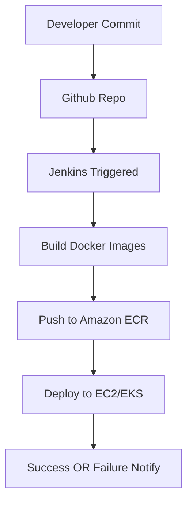

# MERN Stack Deployment on AWS with Docker, Jenkins, EKS & DevOps Automation
This project demonstrates how to deploy a full-stack MERN (MongoDB, Express, React, Node.js) application using AWS infrastructure, Docker containers, CI/CD with Jenkins, Kubernetes (EKS), and automation using Python Boto3 scripts. It includes infrastructure-as-code, monitoring, backup automation, and ChatOps.

---
## Project Overview
This project shows how to build and deploy a production-grade MERN stack app with:
- Containerization using Docker
- Version control using AWS CodeCommit
- CI/CD using Jenkins and Amazon ECR
- Infrastructure provisioning with Boto3 (Python)
- EKS (Kubernetes) deployment with Helm
- Monitoring, backups, and notifications using CloudWatch, Lambda, S3, and SNS

---
## Tech Stack
- **Frontend:** React (Dockerized)
- **Backend:** Node.js + Express (Dockerized)
- **Database:** MongoDB
- **Infrastructure:** AWS (EC2, VPC, ECR, S3, Route 53, ALB, Lambda, EKS)
- **CI/CD:** Jenkins, CodeCommit
- **IaC:** Python + Boto3
- **Monitoring:** CloudWatch
- **Notifications:** SNS, SES, Slack (ChatOps)

---
## Infrastructure Components
| Component            | Service                |
|---------------------|------------------------|
| Source Control       | GitHub         |
| CI/CD                | Jenkins on EC2         |
| Containers           | Docker, Amazon ECR     |
| Compute              | EC2, Auto Scaling Group|
| Load Balancer        | Application Load Balancer (ALB) |
| Networking           | VPC, Subnets, Security Groups |
| DNS                  | Cloudflare               |
| Kubernetes (optional)| Amazon EKS, Minikube             |
| Monitoring           | CloudWatch             |
| Notifications        | SNS + Lambda + Slack   |
| Backup               | MongoDB dump via Lambda to S3 |

---
## Setup Guide
### Step 1: AWS CLI & Boto3 Setup
```bash
aws configure
pip install boto3
```
### Step 2: Dockerize the MERN App
- App Source code repo URL - "https://github.com/tanujbhatia24/SampleMERNwithMicroservices.git"
- Dockerfile for frontend
- Dockerfile for backend

### Step 3: Push Docker Images to ECR
```bash
# Create repos
aws ecr create-repository --repository-name <repo-name>

# Authenticate & push
aws ecr get-login-password | docker login --username AWS <ecr-url>
docker build -t <name> .
docker tag <name> <ecr-url>
docker push <ecr-url>
```

### Step 4:  Set Up CodeCommit/Github repo
- NOTE: Used GIT instead of CodeComiit.

### Step 5: Jenkins CI/CD
- Jenkins installed on EC2 OR use HeroVired Jenkins
- Jobs:
  - Build & push Docker images
  - Trigger on CodeCommit webhook

### Step 6: Infrastructure Provisioning with Boto3
- Python scripts to create:
  - VPC, subnets
  - Security groups
  - EC2 Launch Templates
  - Auto Scaling Group for backend
  - ELB

### Step 7: Deploy Frontend and Backend
- Backend on EC2 (Auto Scaling Group)
- Frontend on EC2
- Use user_data in EC2 to run Docker container

### Step 8: Set Up Load Balancer and DNS
- ALB routes traffic to backend
- Route 53/Cloudflare maps domain to ALB

### Step 9: MongoDB Backup with Lambda
- Lambda dumps MongoDB → uploads to S3
- Triggered daily via CloudWatch Events

---
## CI/CD Pipeline
**Use Jenkinsfile for CI/CD**

---
## Infrastructure as Code (IaC)
All infrastructure is defined using Python + Boto3 scripts:
- create_infra.py
- lambda-mongo-backup/function.zip
- destroy_infra.py
  
Run with: python create_infra.py<br>
Run with: python destroy_infra.py<br>
Use lambda-mongo-backup/function.zip to create lambda DB backup function.<br>

---
## Monitoring & Logging
- CloudWatch Logs: Collect logs from EC2.
- CloudWatch Alarms: Trigger alerts on high CPU etc.
- CloudWatch Dashboards: Optional for visualization.

---
## ChatOps Integration
- SNS topics for deployment events
- Lambda notifies Slack/MS Teams/Telegram via webhook [You can use lambda_SNS.py]
- SES configured for email alerts (e.g., failed backups)

---
## Security Best Practices
- Use IAM Roles instead of hardcoded credentials
- Open only required ports in security groups (e.g., 80, 22)
- Use HTTPS with SSL (ACM + ALB)
- Keep secrets in AWS Secrets Manager or SSM Parameter Store

---
## Final Validation Checklist
- Frontend accessible via domain
- Backend responds correctly
- Docker images present in ECR
- CI/CD triggers on commits
- Logs visible in CloudWatch
- Backup stored in S3
- Notifications received

---
## Snapshot for validation
- **Infrastructure as Code (IaC) with Boto3**<br>
<br>
<br>
<br>
<br>
<br>

- **Backend & Frontend on EC2s**<br>
<br>
<br>

- **EC2 IAM role**<br>
<br>

- **Terminated one Backend and ASG created a new one immediately**<br>
<br>

- **ECS IMAGE**<br>
<br>
<br>

- **Docker container running status**<br>
<br>
<br>
<br>
<br>
<br>
<br>

- **Load Balance & Target Group for backend service**<br>
<br>
<br>
<br>

- **DNS setup**<br>
<br>
<br>

- **Backup of Db using Lambda Functions**<br>
<br>
<br>

- **EKS** <br>
<br>
<br>
  - backend<br>
<br>
<br>
  - frontend<br>
<br>
<br>

- **Cloudwatch Monitoring, Alerting & Logging**<br> 
<br>
<br>
<br>

- **ChatOps Integration (Telegram)**<br>
<br>
<br>
<br>

- **Destroying INFRA**<br>
<br>
<br>

---
## Author
Tanuj Bhatia
